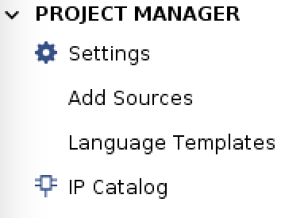
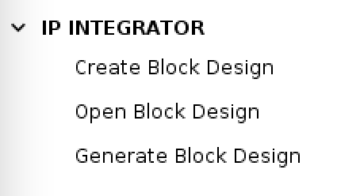
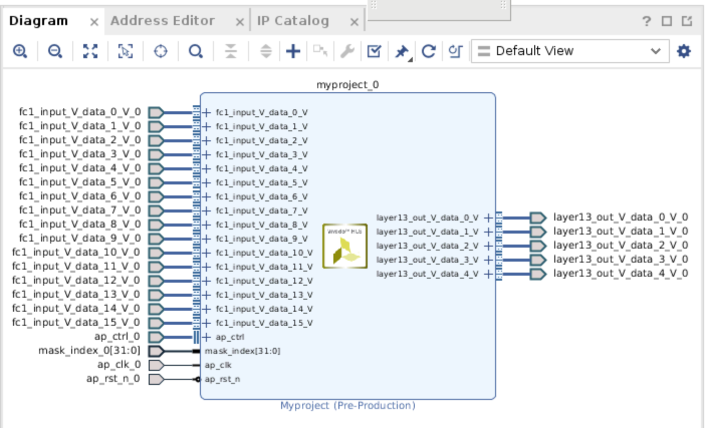
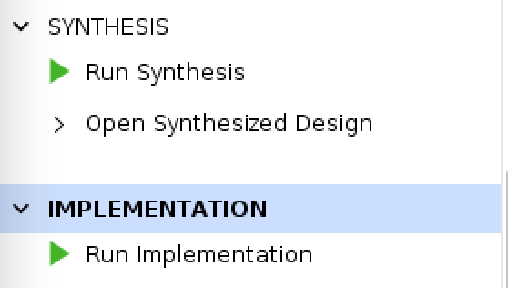

## Useful tutorial

The following tutorial is very useful when we buit the code.

- [qkeras_tutorial](https://github.com/fastmachinelearning/hls4ml-tutorial/blob/master/part4_quantization.ipynb)
- [mnist_lenet_tutorial](https://github.com/matthewrenze/lenet-on-mnist-with-keras-and-tensorflow-in-python/blob/master/MNIST-LeNet.py).

## Qkeras Usage

To install qkeras, run `pip3 install qkeras`.

To train the model, run

```
bash mnist_lenet.sh
```

To load the saved model in your hls4ml code, use

```
from tensorflow.keras.models import load_model
from qkeras.utils import _add_supported_quantized_objects
co = {}
_add_supported_quantized_objects(co)
model = load_model('mnist_lenet.h5', custom_objects=co)
```

You can change the model name as you like in both the training script and your code.

## HLS4ML Conversion

How to set `ap_fixed` is one thing you need to be careful. For example, some issues mention you need to increase the bit width by 1 due to the sign bit ([link](https://github.com/fastmachinelearning/hls4ml/pull/405)). I haven't read them carefully, but if you have any problems, try to look at their [issues](https://github.com/fastmachinelearning/hls4ml/issues) first.

## Vivado Implementation

### Before Implementation: Generate IP

IP can either be exported in the Vivado HLS Gui or by hls4ml using

```
hls_model.build(csim=False, export=True)
```

An ip direcotry will be generated under impl folder.

### Implementation

1. Create a new project
2. Open IP Catalog window and add the IP repository.

   

3. Open the block design for the IP repository.

   

4. Right click the block design diagram and select `make external` to connect the ports.

   

5. Import constraint(change the clock name so it matches)
6. Add HDL Wrapper
7. Run synthesize and implementation to get the power consumption report.

   
